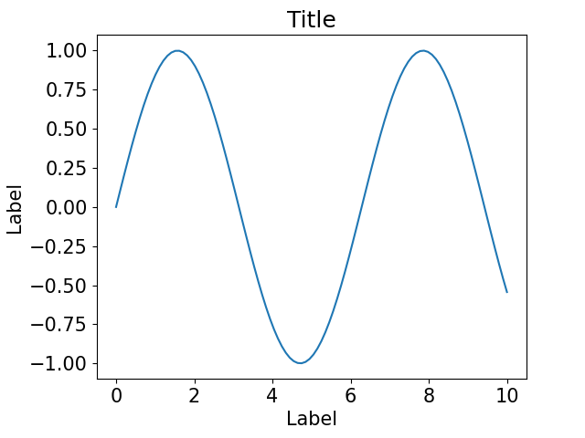

# Matplotlib
Utility scripts for [matplotlib 3](https://matplotlib.org/).

## Usage examples

### Basic usage
```python
import matplotlib.pyplot as plt
from readable_plots import *  # readable_plots.py must be in the working dir
FONT_SIZE = 15  # 10 is matplotlib's default, 22 is very large
set_style(FONT_SIZE)  # Must be called *before* creating the figure
plt.figure()
plt.plot(x_data, y_data)
plt.title("Title")
plt.xlabel("Label")
plt.ylabel("Label")
```


### Subplots
```python
set_style(FONT_SIZE, n_rows=2)  # Recomputes margins and paddings
plt.figure()
plt.subplot(211)
plt.plot(x1, y1)
plt.title("Title")
plt.xlabel("Label")
plt.ylabel("Label")
plt.subplot(212)
plt.plot(x2, y2)
plt.xlabel("Label")
plt.ylabel("Label")
```


### Subplots without space between plots
```python
set_style(FONT_SIZE, n_rows=0)  # No padding
plt.figure()
plt.subplot(211)
plt.plot(x1, y1)
plt.title("Title")
hide_ticks(plt.gca(), 'x')  # Do not display ticks on top plot
plt.ylabel("Label")
plt.subplot(212)
plt.plot(x2, y2)
plt.xlabel("Label")
plt.ylabel("Label")
```


### Y axis with two scales
```python
set_style(FONT_SIZE)
plt.figure()
fig, ax1 = plt.subplots()
c1 = 'tab:blue'
ax1.set_title("Title")
ax1.plot(x1, y1, color=c1)
ax1.set_xlabel("Label")
ax1.set_ylabel("Label", color=c1)
ax1.tick_params(axis='y', labelcolor=c1)
ax2 = ax1.twinx()
c2 = 'tab:red'
ax2.plot(x2, y2, color=c2)
ax2.set_ylabel("Label", color=c2)
ax2.tick_params(axis='y', labelcolor=c2)
set_symmetric_horizontal_margins()  # Make room for the rightmost y axis label
```

